# bombom
<strong>카페봄봄사이트를 보고 Vue로 사이트 만들어보기(Vue공부)</strong>

리팩토링  진행중 (2023.06.13) 

# 기획 배경
happyhouse를 진행할 때는 jsp로 진행하던 걸 마지막에 vue로 바꿔야 해서 게시판들만 vue로작업해서 build하여 합쳤었습니다. 
그래서 1학기가 끝나고, 잠깐의 방학기간동안, vue로 한번 작업 해보고 싶어 Vue에 익숙해질 겸, 공부해볼 겸 따라만들어 볼 사이트를 찾다가 카페봄봄 사이트를 따라 만들게 되었습니다. 
vue로 모두 작업한 조의 작품을 참고하여 파일구성부터 하나하나 배워가며, 만들어 보았습니다. 

# 개발 기간
2020.12.17 ~ 2020.12.29

# 공부목표
ㅇ Vue로 작업 시 component 나누기에 익숙해지기. 
ㅇ axios통신하는 방법에 익숙해지기. 
ㅇ 참고를 하면서 흐름과, 코드보는방법에 익숙해지기. 
ㅇ 지도 api 사용해보기

# 소개 보러가기
http://cjh1114.cafe24.com/bombom/index.html

# ERD
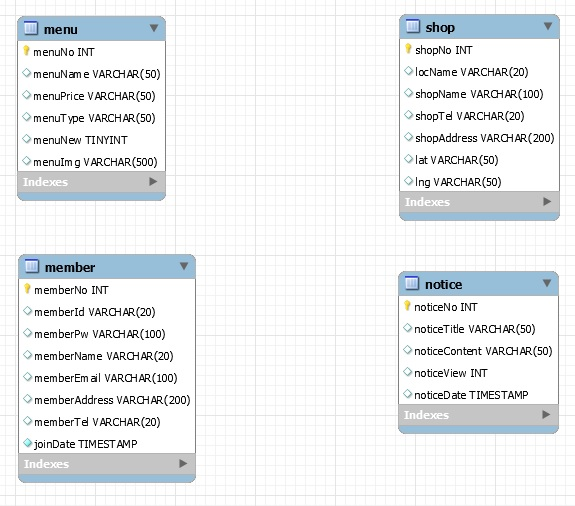

# 주요 기능

## 메인페이지
#### 1. vuetify의 carousels을 이용하여 배너 이미지를 슬라이드로 구현하였습니다.

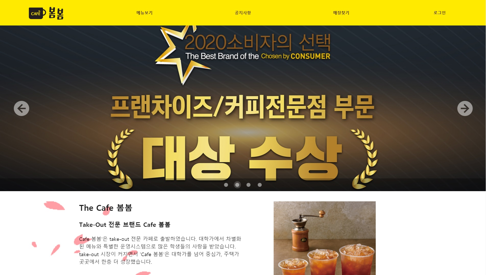

#### 2. 배경으로 gif를 넣어 꽃이 흩날리는 이미지를 넣었습니다.

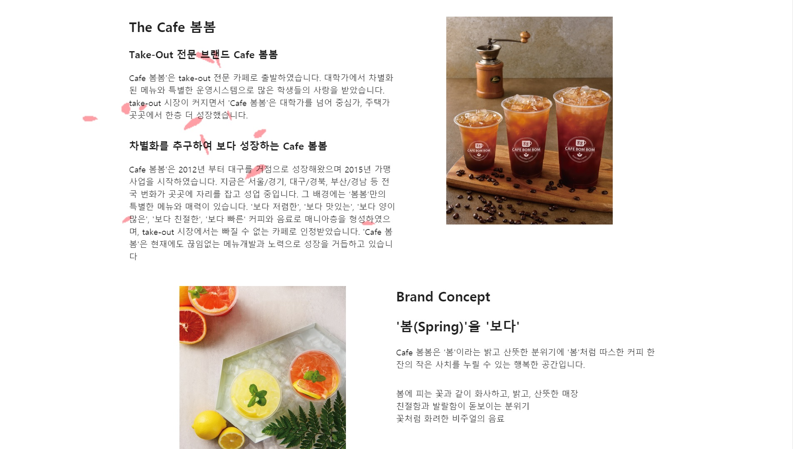

#### 3. google api를 이용하여 본점과 교육장의 위치를 마커로 찍어 확인할 수 있게 하였습니다.

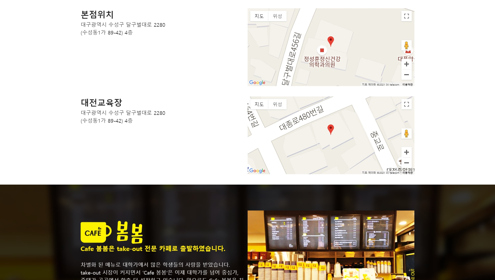

## 회원관련
#### 1. 회원가입

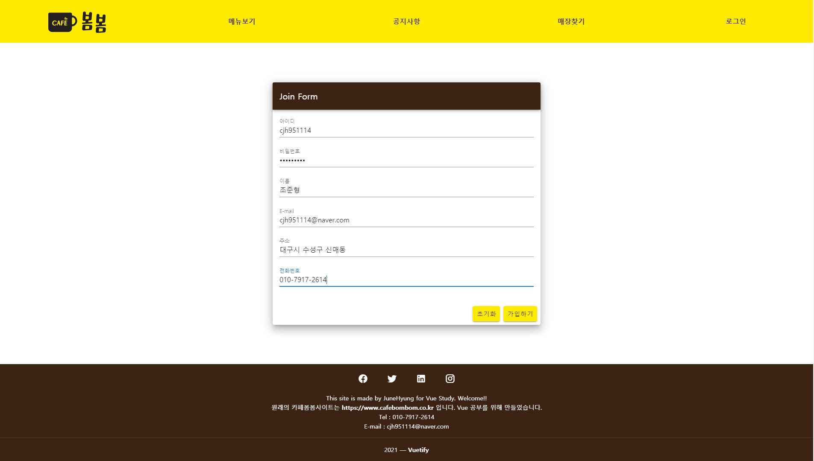

#### 2. 로그인

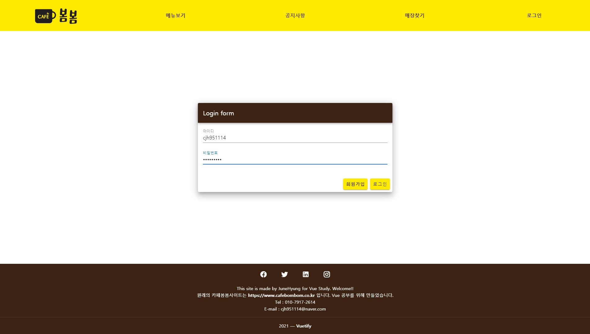

#### 3. 마이페이지

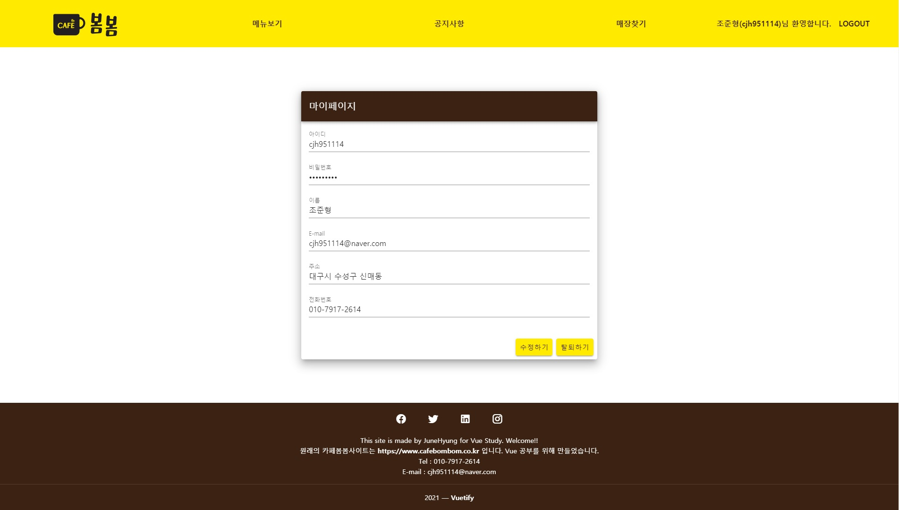

#### 4. 회원정보 수정

#### 5. 회원탈퇴

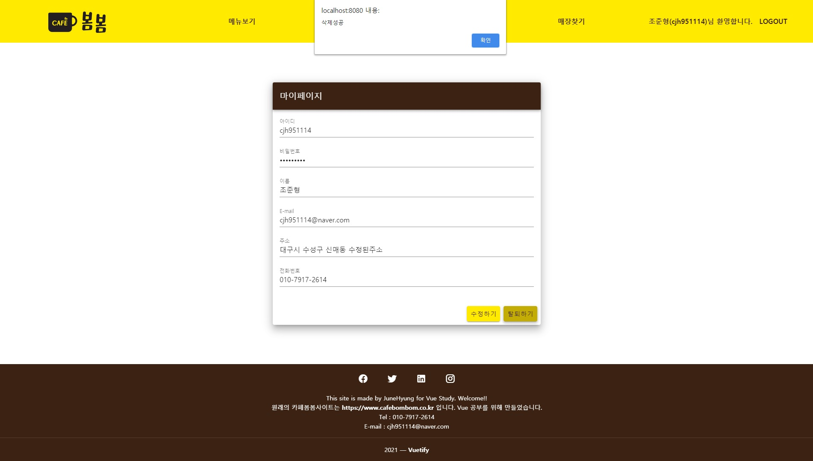

## 메뉴
#### 1. 각 탭을 클릭 시 클릭한 이름에 맞는 음료타입의 음룔르 v-card를 반복하여 출력하였습니다.

#### 2. 출력 시 이름과 가격을 출력하였습니다.

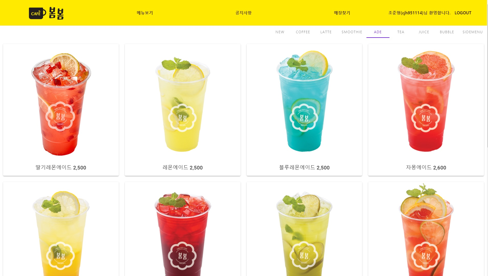

## 공지사항
#### 1. v-data-table을 이용하여 공지사항table에 담긴 정보를 출력합니다.

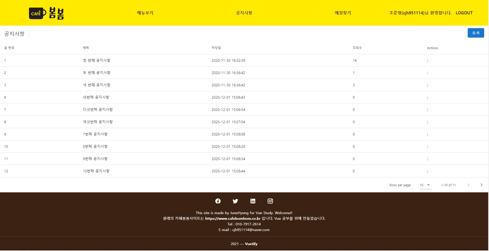

#### 2. 등록 버튼을 눌러 공지사항 등록 dialog가 open됩니다.

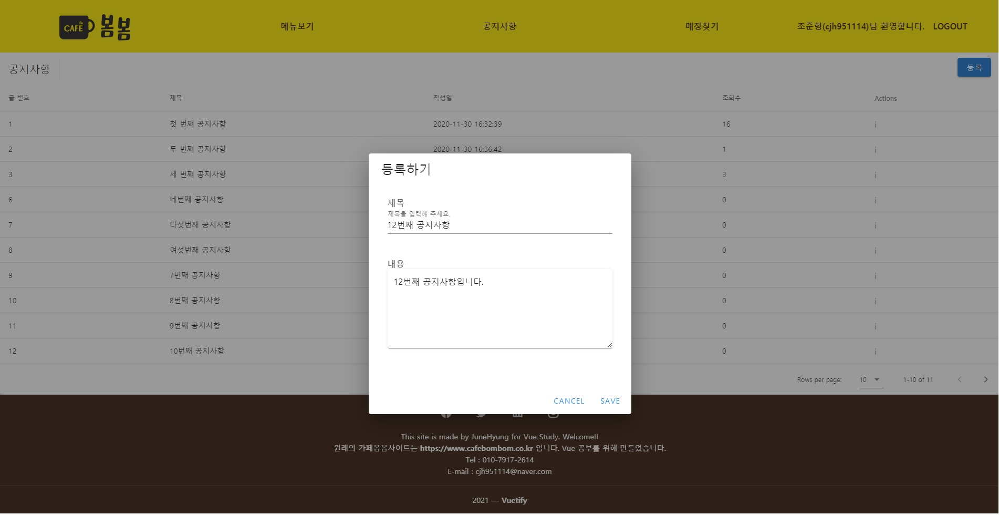

#### 3. i버튼을 눌러 공지사항의 내용을 확인 할 수 있습니다.

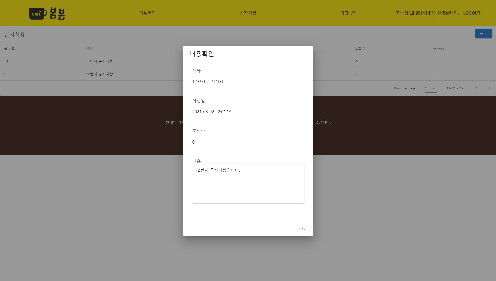

## 매장찾기
#### 1. google api를 통해 지역별로 매장의 위치를 지도에 출력 합니다.

#### 2. v-data-table을 통해 매장의 정보를 테이블로 출력 합니다.

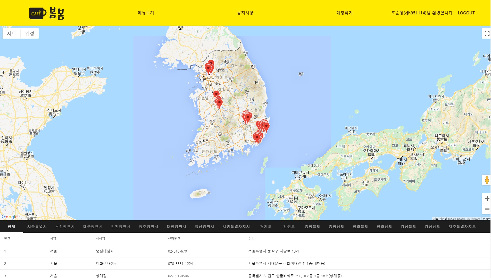
