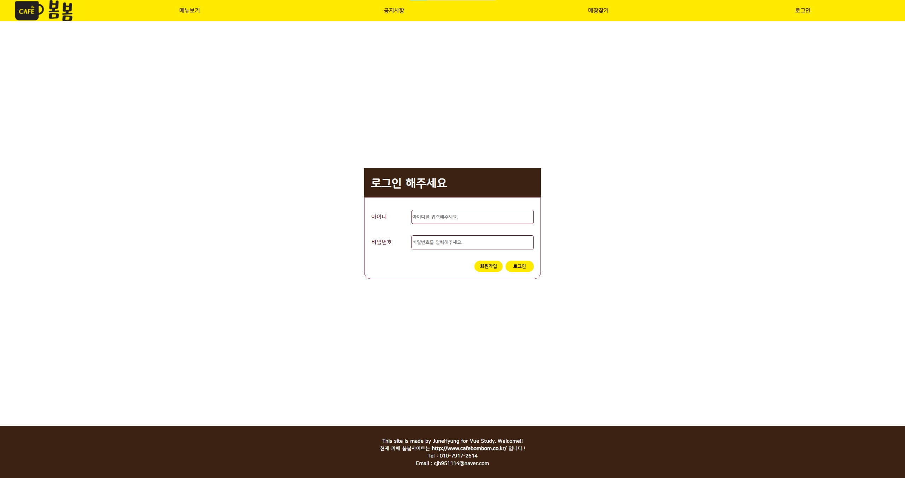

# Bombom

<strong>카페봄봄사이트를 보고 Vue로 사이트 만들어보기(Vue공부)</strong>

## 🚩 기획 배경

Vue를 익히기 위해 카페봄봄 사이트를 보고, 만든 프로젝트입니다. 초기 완성은 2021년에 완료하였고, 2023년에 와서 리팩토링을 진행하였습니다. 초기 프로젝트는 Vue2로 작업을 진행하였었고, Vue3 공식문서에서 Vue2의 지원이 2023년 12월 31에 종료된다고 공지되있습니다. 그렇기 때문에 `Vue2를 Vue3로 마이그레이션` 하며, Vue3공식문서에서도 Vuex의 새로운 업데이트가 일어나지 않는다고 되있어 `Pinia도 같이 사용`하였습니다. 이외에도 컴포넌트 개발, Typescript사용, Node.js 사용등의 목적으로 리팩토링을 진행하였습니다 😀

### 📘 참고

*  [Vue3 소개 페이지 - Vue2 지원 중단내용](https://vuejs.org/guide/introduction.html)
* [Vue3 공식문서 - Pinia관련](https://vuejs.org/guide/scaling-up/state-management.html#ssr-considerations)

## 🎯 공부 목표

**초기 (2021)**

* Vue로 작업 시 component 나누기에 익숙해지기.
* axios통신하는 방법에 익숙해지기.
* 참고를 하면서 흐름과, 
* 코드보는방법에 익숙해지기.지도 api 사용해보기

**리팩토링(2023)**

* Vue2 -> Vue3 마이그레이션
* Vuetify라이브러리를 사용않고, 컴포넌트 직접개발
* Typescript 사용
* Pinia 사용
* Node.js로 Backend 사용해보기
* UI Framework CSS 일부 구현 해보기
* 파일 분리 (구조 개선)

## 🌏 ERD

Shop Table에 좌표값을 저장하던 것을 주소를 저장하게 변경하였습니다.

## 🌏 주요 기능

### 👉 메인페이지

vuetify의 carousels을 이용하여 배너 이미지를 슬라이드로 구현한 것을 배너 이미지의 list정보를 받아 슬라이드를 구현하였습니다.

Kakao API를 사용하여 고정된 위치를 마커로 표시하였습니다.

### 👉 회원관련

Form의 디자인을 일부 수정하였습니다.

#### 회원가입

#### 로그인

#### 마이페이지

마이페이지에 들어가기 전 비밀번호 확인을 추가하여 통과 시 이동하도록 하였습니다.

#### 회원정보 수정

#### 회원탈퇴

### 👉 메뉴

Vuetify의 컴포넌트를 이용해 보여주던 메뉴리스트들을 디자인을 수정하여 개발하였습니다.

### 👉 공지사항

Vuetify의 v-data-table을 이용하던 것을 table태그를 이용해 구현하였습니다.

관리자의 권한유무에 따라 등록버튼과 수정 삭제가 가능한 Action의 icon이 display 됩니다.

#### 권리자 권한 없음

#### 관리자 권한

#### 등록, 수정, 삭제

각 등록, 수정, 삭제는 Modal에 display되어 수행합니다.

### 👉 매장 찾기

Google API 에서 Kakao API로 변경하였고, 해당 API를 사용해 매장의 위치를 지도에 표시하고, 목록을 리스트업합니다.

목록은 Vuetify의 v-data-table을 사용하던 것을 직접 구현하여 변경하였습니다.

